# Installer le projet

Voici les étapes pour installer le projet

## Ce qui faut télécharger

- Télécharger la version la plus recente de virtual box

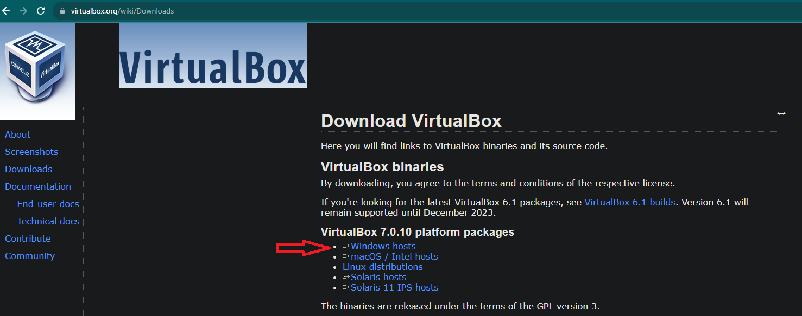

- Télécharger l'iso ubuntu server version **14.04** (cet version précisement)

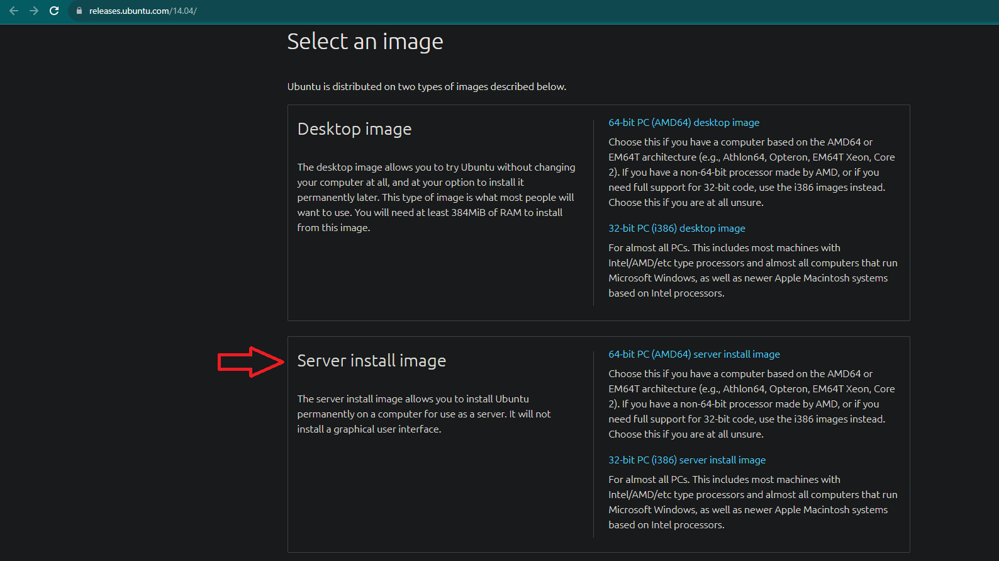

- Télécharger Visual Studio code

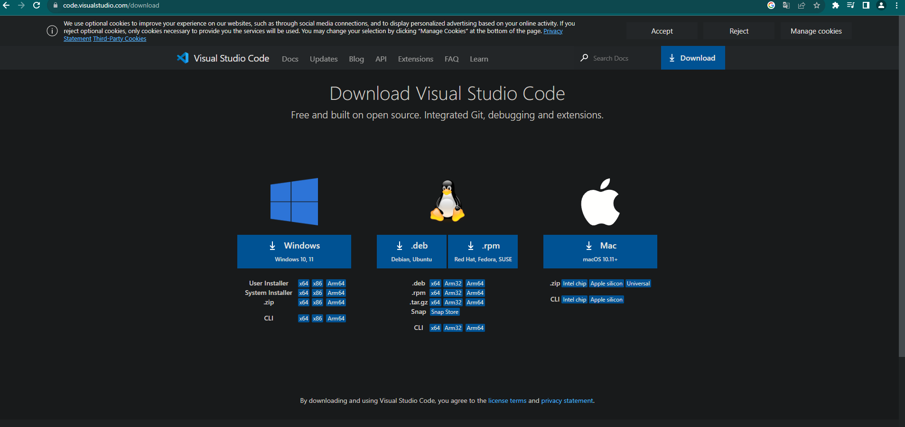

## Installation du serveur  

- Ouvré Virtual Box et cliquer sur **Nouvelle**

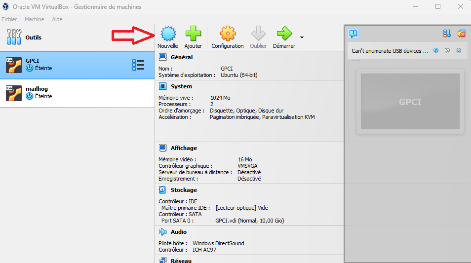

- Cliqué sur la barre déroulante **ISO Image:**
- Cherhcé votre iso ubuntu
- Changer le **Nom :** par celui que vous voulez
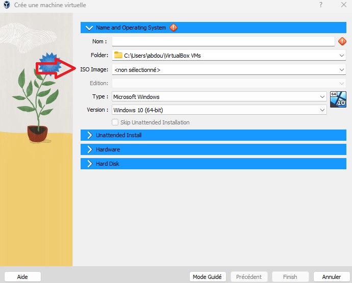

- Des losanges rouges avec un point d'éxlamation devrait s'afficher dans l'onglet Unattended Install
- Modifier le **Hostname**, **Username** (doit être en minuscule) et le **Password**

> Dans les anciennes version de virtualbox **Username** et le **Password** se faisait pendant l'installation du server

- Cliquer sûr **Finish**
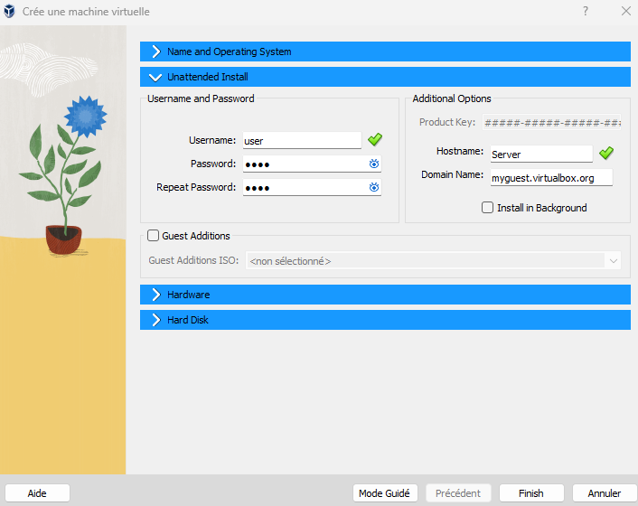

## Entrer dans le serveur  

Cliquer sûr **Démarrer**
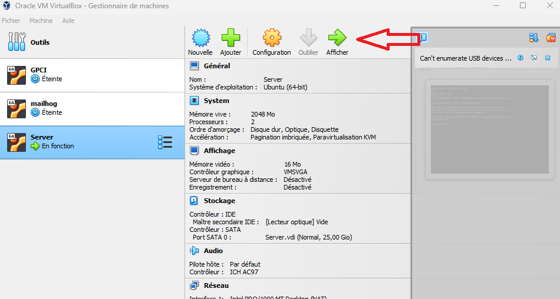

Aprés avoir démarrer entrer vos identifiants
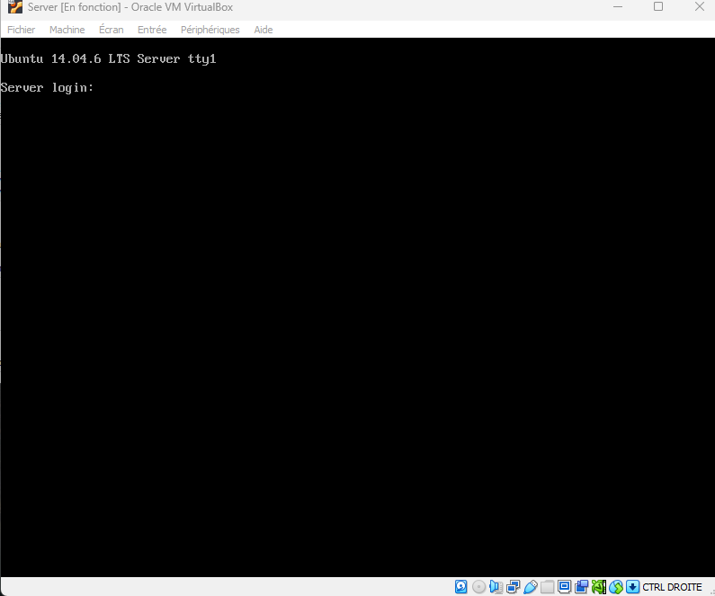

Changer le réseau de votre votre serveur de **Nat** en **Accès par ponts**
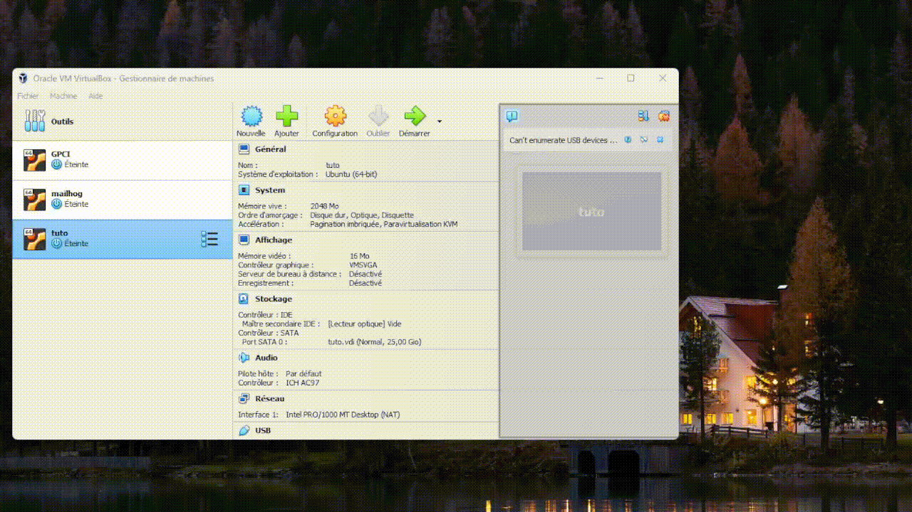

## Partager les fichier avec SFTP

Installer Git

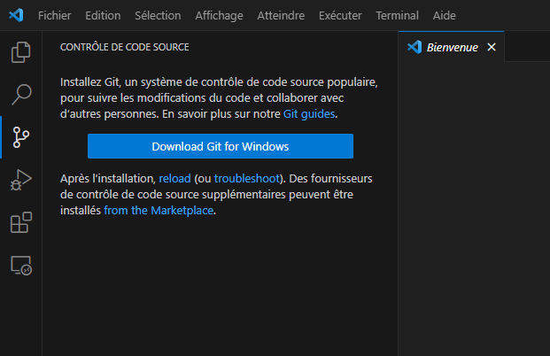

Installer l'exention SFTP de "Natizyskunk"

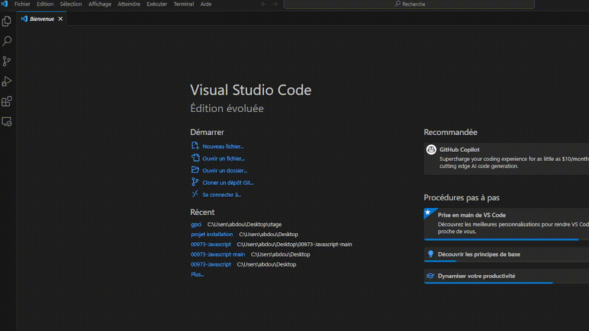

Ouvrer le projet gpci ou cloner le dépot si vous ne l'avez pas encore fait


Appuyer sur la combinaison de touche **ctrl+shift+p**
Taper **sftp**
Changer ces information du fichier sftp.json:

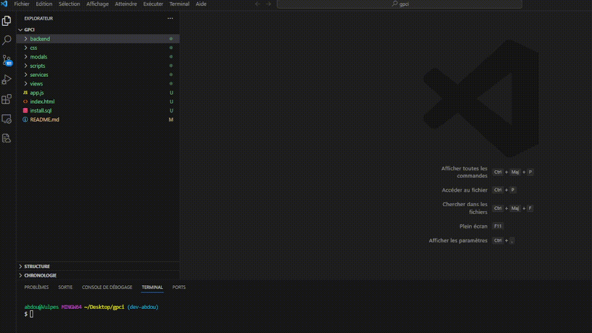

```json
{
    "name": "Nom que vous voulez",
    "host": "l'addresse ip de votre serveur",
    "protocol": "sftp",
    "port": 22,
    "username": "username de votre serveur",
    "username": "mot de passe de votre serveur",
    "remotePath": "/",
    "uploadOnSave": false,
    "useTempFile": false,
    "openSsh": false
}
```

## Installer apache et phpmyadmin

Taper cet commande dans le serveur:

```bash
sudo apt-get -y install apache2** pour installer apache
sudo apt-get -y install mysql-5.6** pour installer mysql
sudo apt-get -y install phpmyadmin** pour installer mysql
```

Taper **votre-adresse-ip** pour voir si apache fonctionne
Taper **votre-adresse-ip/phpmyadmin** pour voir si phpmyadmin fonctionne

Si apache fonctionne pas taper :

```bash
sudo iptables -A INPUT -p tcp --dport 80 -j ACCEPT
sudo iptables -A INPUT -p tcp --dport 443 -j ACCEPT
sudo service ufw restart user
```

Ajouter le site GPCI dans /etc/apache2/sites-available:
`sudo nano /etc/apache2/sites-available/gpci.conf`

```php
<VirtualHost *:80>
  ServerAdmin webmaster@localhost
  DocumentRoot /var/www/gpci
  <Directory /var/www/gpci>
    AllowOverride All
  </Directory>      
  
  ErrorLog ${APACHE_LOG_DIR}/error.log
  CustomLog ${APACHE_LOG_DIR}/access.log combined

</VirtualHost>
```

Ajouter phpmyadmin à la configuration apache :

```bash
sudo ln -s /etc/phpmyadmin/apache.conf /etc/apache2/conf-available/phpmyadmin.conf
sudo a2enconf phpmyadmin
sudo a2ensite gpci
sudo service apache2 restart
```

Vérifier en tapant `cd /etc/apache2/sites-available/**` que **phpmyadmin.conf** est present sinon taper **nano mon_fichier.conf** et copier le code suivant

```php
# phpMyAdmin default Apache configuration

Alias /phpmyadmin /usr/share/phpmyadmin

<Directory /usr/share/phpmyadmin>
  Options FollowSymLinks
  DirectoryIndex index.php

  <IfModule mod_php5.c>
    AddType application/x-httpd-php .php

    php_flag magic_quotes_gpc Off
    php_flag track_vars On
    php_flag register_globals Off
    php_admin_flag allow_url_fopen Off
    php_value include_path .
    php_admin_value upload_tmp_dir /var/lib/phpmyadmin/tmp
    php_admin_value open_basedir /usr/share/phpmyadmin/:/etc/phpmyadmin/:/var/lib/phpmyadmin/:/usr/share/php/php-gettext/:/usr/share/javascript/
  </IfModule>

</Directory>

# Authorize for setup
<Directory /usr/share/phpmyadmin/setup>
    <IfModule mod_authn_file.c>
    AuthType Basic
    AuthName "phpMyAdmin Setup"
    AuthUserFile /etc/phpmyadmin/htpasswd.setup
    </IfModule>
    Require valid-user
</Directory>

# Disallow web access to directories that don't need it
<Directory /usr/share/phpmyadmin/libraries>
    Order Deny,Allow
    Deny from All
</Directory>
<Directory /usr/share/phpmyadmin/setup/lib>
    Order Deny,Allow
    Deny from All
</Directory>
```

## Enregistrer le projet sur le serveur

Dans vscode aller aux fichier sftp et changer "remothPath" par ce chemin :

```json
{
    "name": "Nom que vous voulez",
    "host": "l'addresse ip de votre serveur",
    "protocol": "sftp",
    "port": 22,
    "username": "username de votre serveur",
    "username": "mot de passe de votre serveur",
    "remotePath": "/var/www/",
    "uploadOnSave": false,
    "useTempFile": false,
    "openSsh": false
}
```

1. Cliquer sur l'onglet sftp
2. Cliquer droit et selectionner "upload"

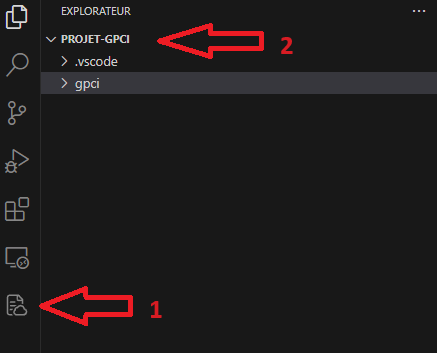

## Lien symbolique

Aller dans le dossier `/etc/apache2/sites-available/` et créer un fichier `nom_projet.conf`

Ajouter ce code :

```php
<VirtualHost *:80>

  ServerAdmin webmaster@localhost
  DocumentRoot /var/www/nom_projet
  <Directory /var/www/nom_projet>
    AllowOverride All
  </Directory>      
  
  ErrorLog ${APACHE_LOG_DIR}/error.log
  CustomLog ${APACHE_LOG_DIR}/access.log combined

</VirtualHost>

# vim: syntax=apache ts=4 sw=4 sts=4 sr noet
```

Puis créer un lien symbolique :  
`ln -s /etc/apache2/sites-available/nom_projet.conf /var/www/nom_projet`
