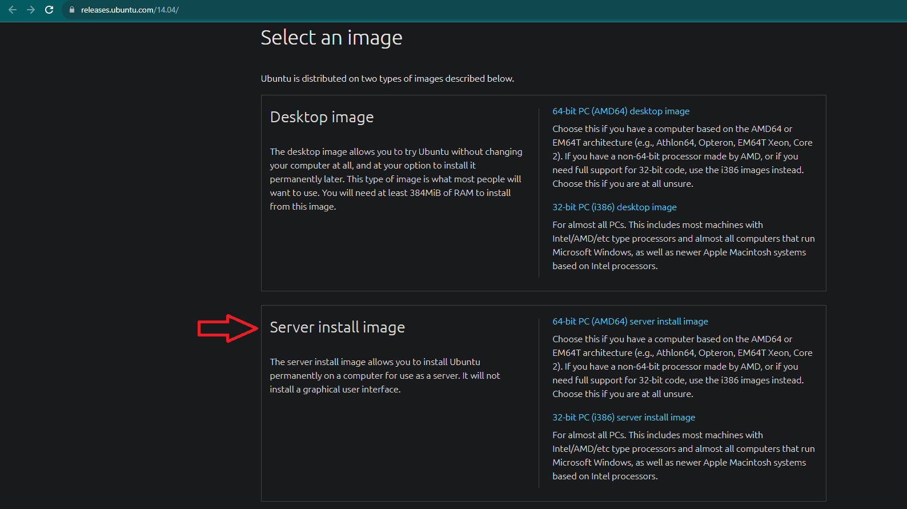

# Installer le projet

Voici les étapes pour installer le projet

## Ce qui faut télécharger

- Télécharger la version la plus recente de virtual box

- Télécharger l'iso ubuntu server version **14.04** (cet version précisement)

- Télécharger Visual Studio code

