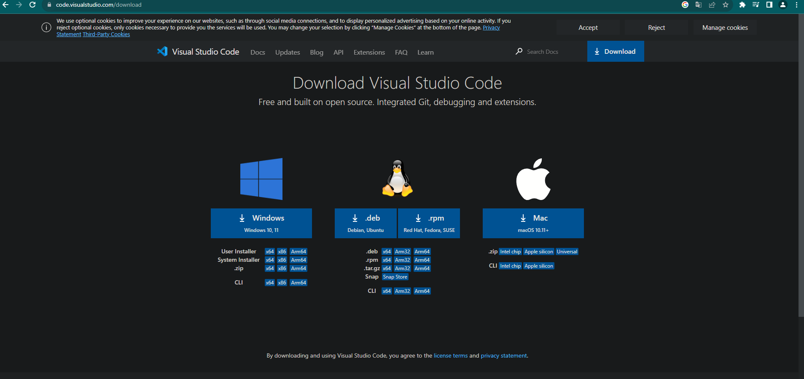
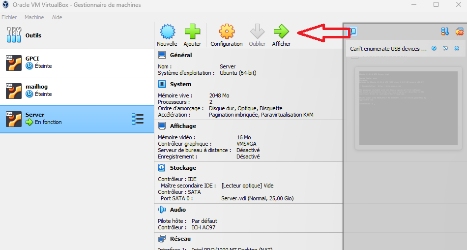
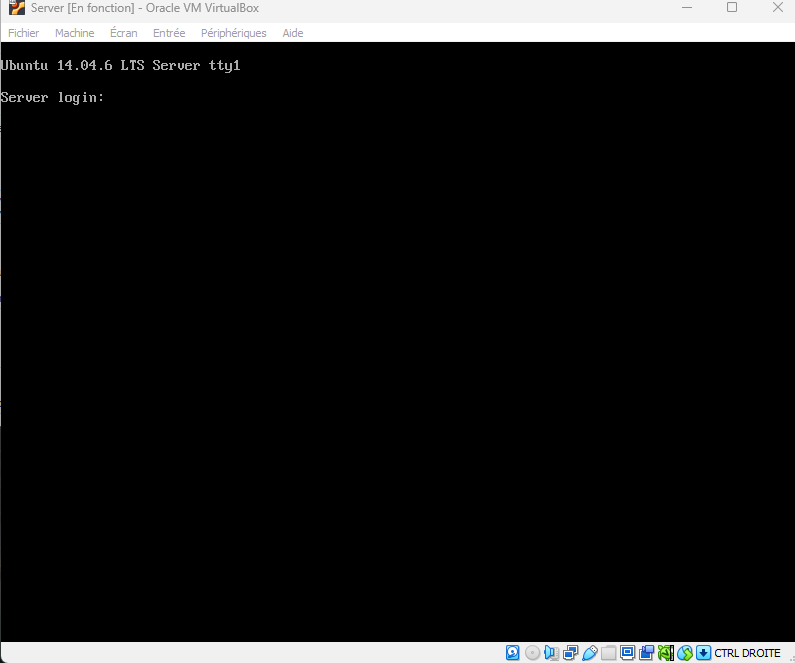
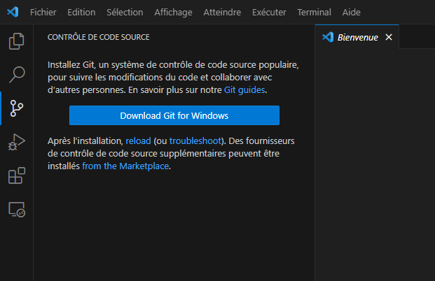
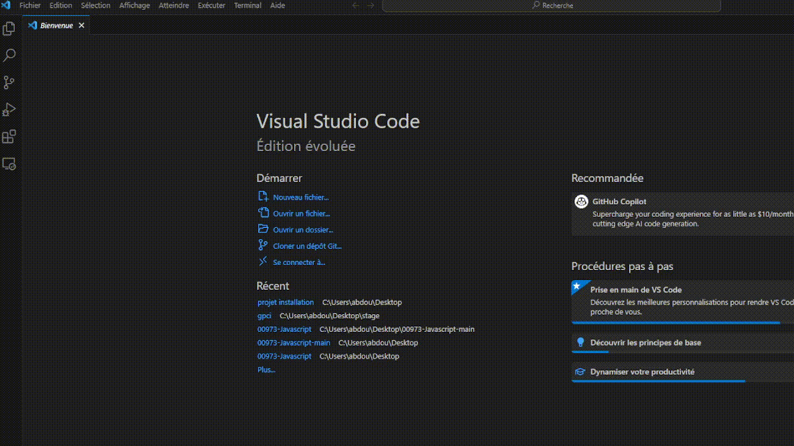

# Installer le projet

Voici les étapes pour installer le projet

## Ce qui faut télécharger

- Télécharger la version la plus recente de virtual box


- Télécharger l'iso ubuntu server version **14.04** (cet version précisement)


- Télécharger Visual Studio code



## Installation du serveur  

- Ouvré Virtual Box et cliquer sur **Nouvelle**


- Cliqué sur la barre déroulante **ISO Image:**
- Cherhcé votre iso ubuntu
- Changer le **Nom :** par celui que vous voulez


- Des losanges rouges avec un point d'éxlamation devrait s'afficher dans l'onglet Unattended Install
- Modifier le **Hostname**, **Username** (doit être en minuscule) et le **Password**

> Dans les anciennes version de virtualbox **Username** et le **Password** se faisait pendant l'installation du server

- Cliquer sûr **Finish**


## Entrer dans le serveur  

Cliquer sûr **Démarrer**


Aprés avoir démarrer entrer vos identifiants


Changer le réseau de votre votre serveur de **Nat** en **Accès par ponts**


## Partager les fichier avec SFTP

Installer Git



Installer l'exention SFTP de "Natizyskunk"


Ouvrer le projet gpci ou cloner le dépot si vous ne l'avez pas encore fait



Appuyer sur la combinaison de touche **ctrl+shift+p**
Taper **sftp**
Changer ces information du fichier sftp.json:


```json
{
    "name": "Nom que vous voulez",
    "host": "l'addresse ip de votre serveur",
    "protocol": "sftp",
    "port": 22,
    "username": "username de votre serveur",
    "username": "mot de passe de votre serveur",
    "remotePath": "/",
    "uploadOnSave": false,
    "useTempFile": false,
    "openSsh": false
}
```
